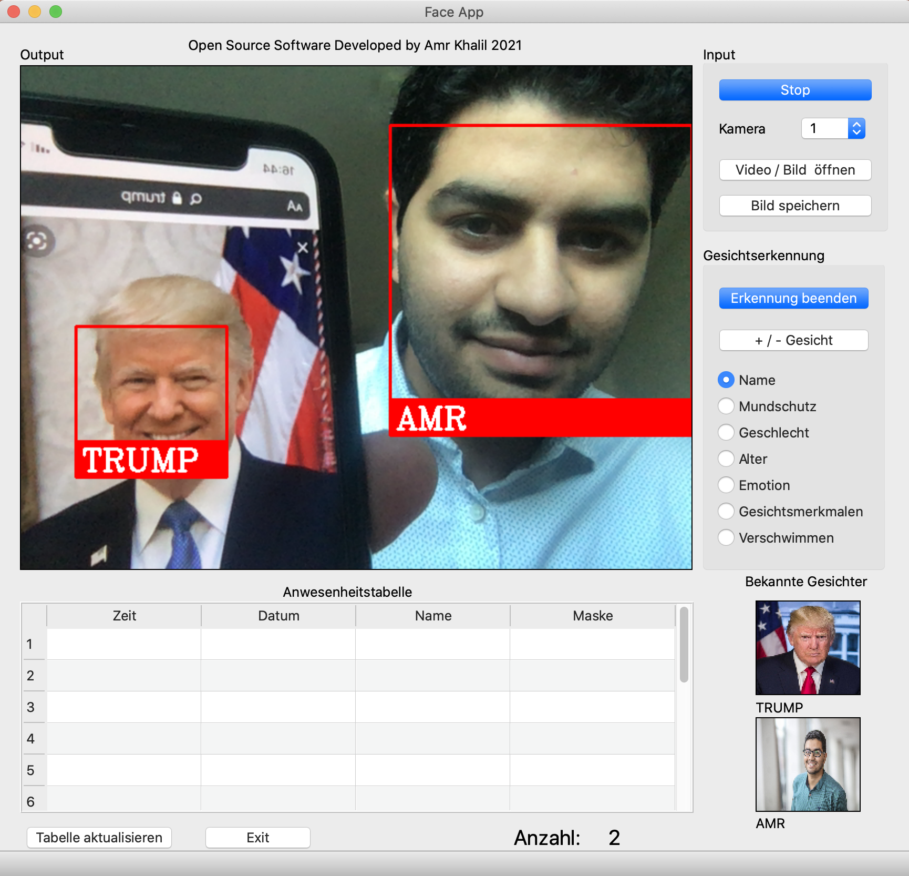
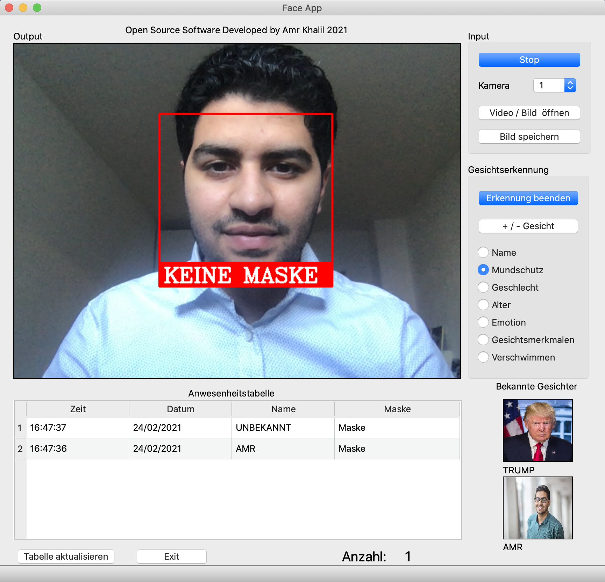
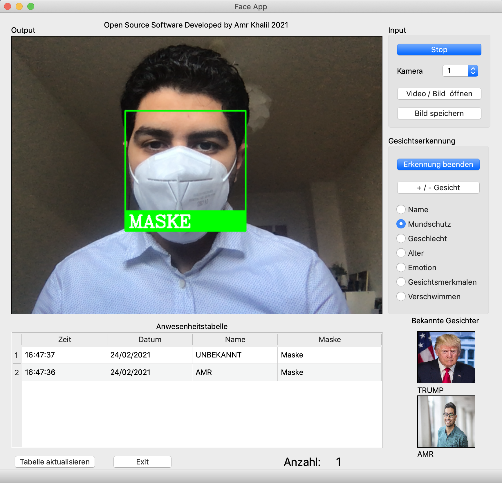
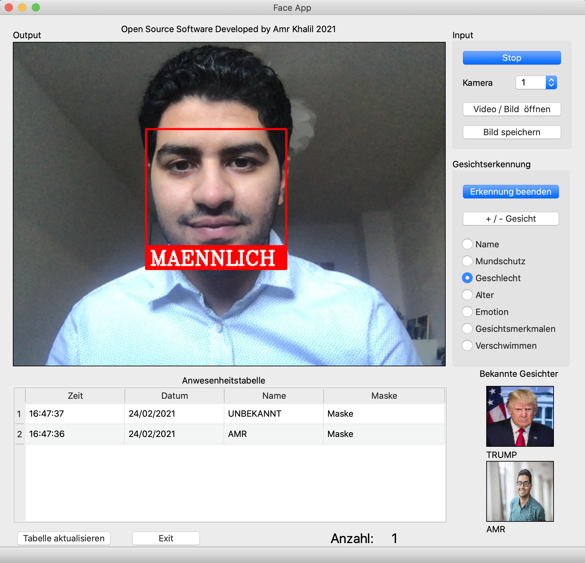
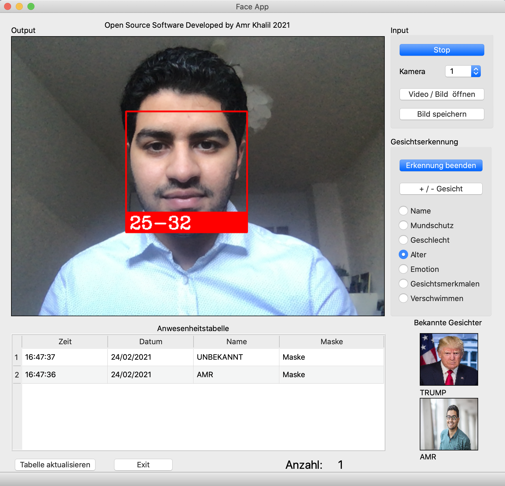
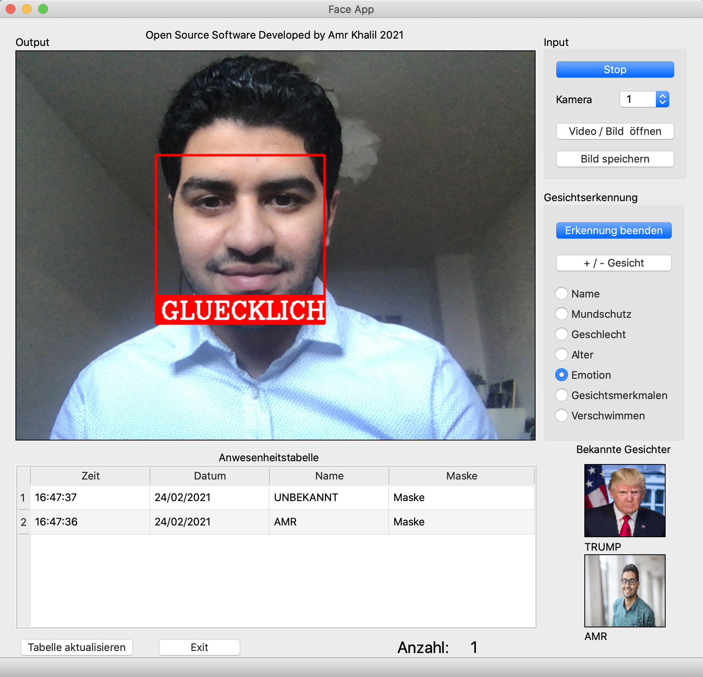
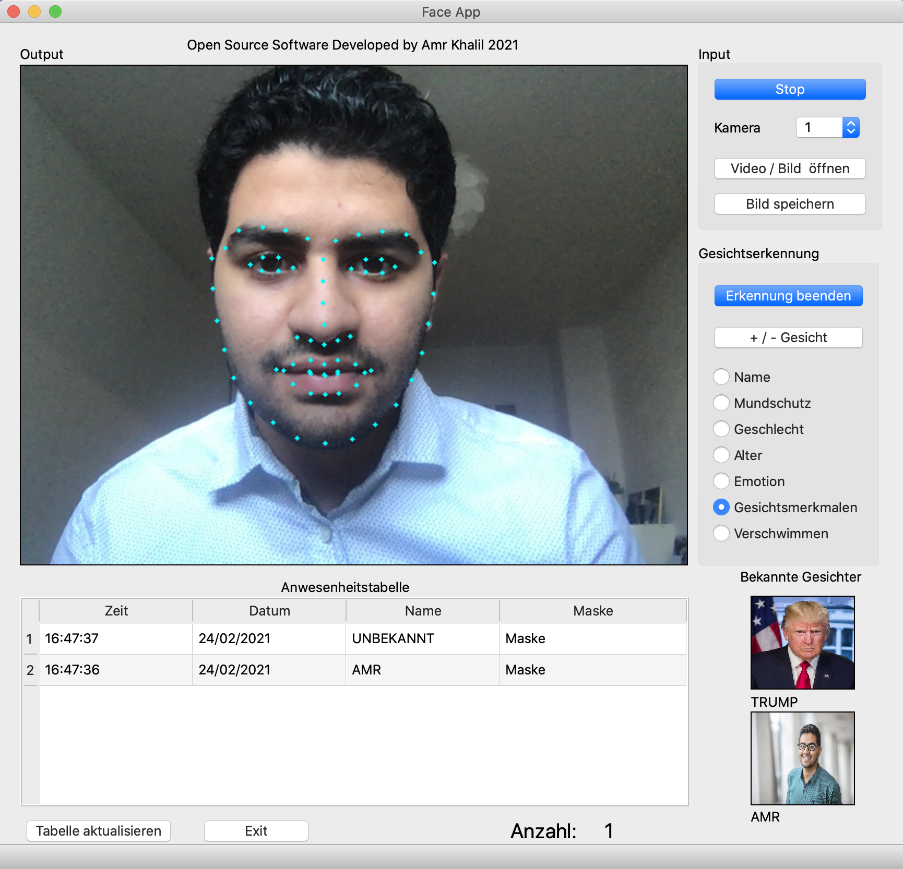
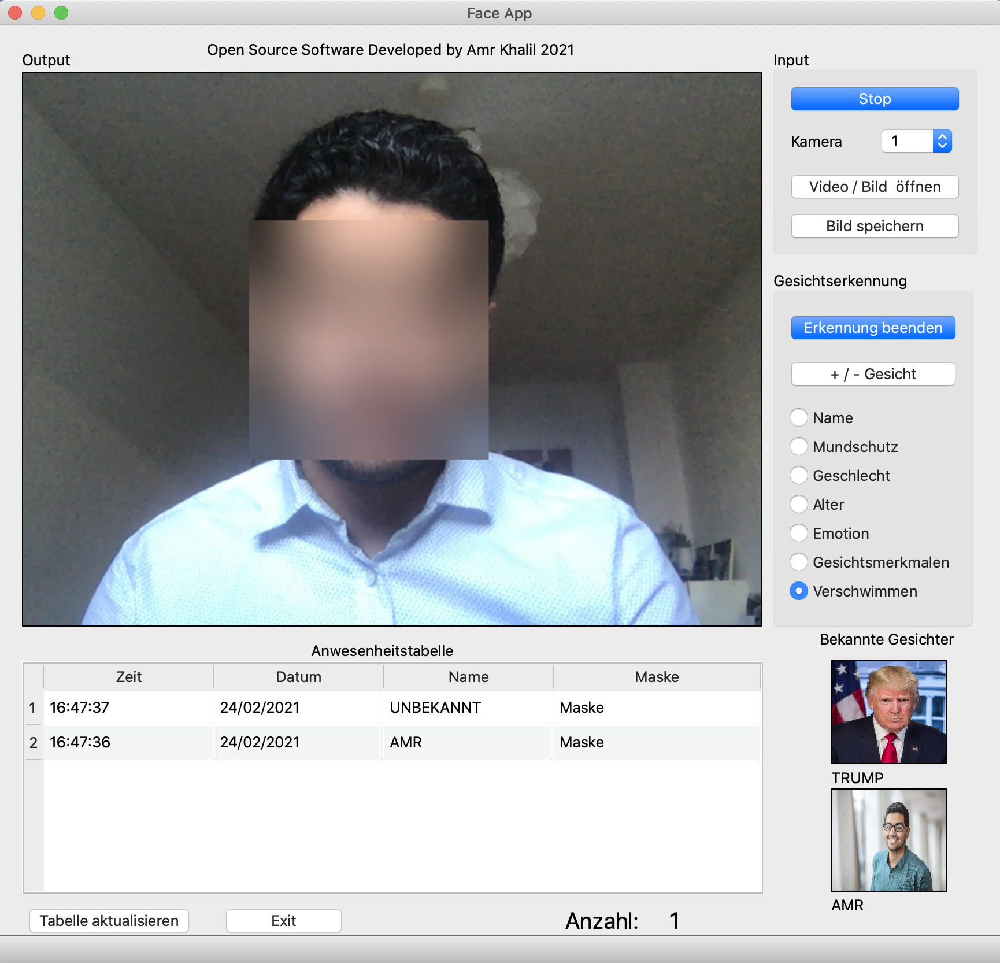

# Face Recognition System
## Author: Amr Khalil
#### Frankfurt a.M. | 2021 | FOM Hochschule 

  

## Face Recognition

  

## Face Mask Detektion

  

  

## Gender Prediction

  

## Age Prediction

  

## Emotion Prediction

  

## Facial Landmarks 

  

## Bluring Face

  

## Instructions
### 1. Install Python
### 2. Download the code and unzip it
### 3. Open the code folder form your shell

### 4. Installing virtualenv
#### On Windows:
py -m pip install --user virtualenv
#### On macOS and Linux:
python3 -m pip install --user virtualenv

### 5. Creating a virtual environment
#### On Windows:
py -m venv env
#### On macOS and Linux:
python3 -m venv env

### 6. Activating a virtual environment
#### On Windows:
env\Scripts\activate
#### On macOS and Linux:
source env/bin/activate

### 7. Install the python libraries
Follow this Video: 
https://www.youtube.com/watch?v=xaDJ5xnc8dc&ab_channel=Pythoholic

### 8. Run the programm
#### On Windows:
py main.py
#### On macOS and Linux:
python main.py
